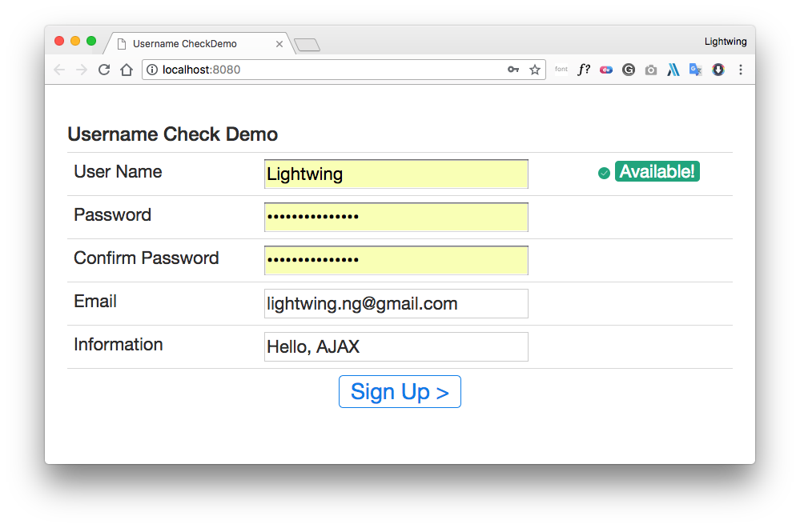

## Ajax & jQuery

### 1 Ajax

#### 1.1 是什么?

​	`AJAX` 即「Asynchronous JavaScript and XML」（异步的 `JavaScript` 与 XML 技术），指的是一套综合了多项技术的浏览器端网页开发技术。

​	并不是新的技术，只是把原有的技术，整合到一起而已。

1. 运用 XHTML + CSS 来表达信息；
2. 运用 JavaScript 操作DOM（Document Object Model）来运行动态效果；
3. 运用 XML 和 XSLT 操作数据
4. 运用 XMLHttpRequest 或新的 Fetch API 与网页服务器进行异步数据交换； 

#### 1.2 有什么用?

​	咱们的网页如果想要刷新局部内容，那么需要重新载入整个网页，用户体验不是很好。  就是为了解决局部刷新的问题。 保持其他部分不动，只刷新某些地方。 

#### 1.3 数据请求 `Get`

1. 创建对象

```javascript
        function ajaxFunction() {
            var xmlHttp;
            try { // Firefox, Opera 8.0+, Safari
                xmlHttp = new XMLHttpRequest();
            }
            catch (e) {
                try { // Internet Explorer
                    xmlHttp = new ActiveXObject("Msxml2.XMLHTTP");
                }
                catch (e) {
                    try {
                        xmlHttp = new ActiveXObject("Microsoft.XMLHTTP");
                    }
                    catch (e) {
                    }
                }
            }

            return xmlHttp;
        }
```

1. 发送请求

```javascript
// 执行 get 请求
function get() {
    // 1.创建 XMLHttpRequest 对象
    var request = ajaxFunction();
    // 2.发送请求
    /*
    * GET/POST
    * Path
    * is asynchronous
    * */
    request.open("GET", "DemoServlet01?name=LightwingNg&age=25", true);
    request.send();
}
```

如果发送请求的同时，还想获取数据，那么代码如下

```javascript
function get() {
    // 1.创建xmlhttprequest 对象
    var request = ajaxFunction();
    // 2.发送请求
    request.open("GET", "/day16/DemoServlet01?name=aa&age=18", true);
    // 3.获取响应数据 注册监听的意思。  一会准备的状态发生了改变，那么就执行 = 号右边的方法
    request.onreadystatechange = function() {
        // 前半段表示 已经能够正常处理。  再判断状态码是否是200
        if (request.readyState == 4 && request.status == 200) {
            // 弹出响应的信息
            alert(request.responseText);
        }
    }
    request.send();
}
```

`DemoServlet01.java`


```java
package com.lightwing.servlet;

import javax.servlet.ServletException;
import javax.servlet.http.HttpServlet;
import javax.servlet.http.HttpServletRequest;
import javax.servlet.http.HttpServletResponse;
import java.io.IOException;

/**
 * Servlet implementation class DemoServlet01
 */
public class DemoServlet01 extends HttpServlet {
    protected void doGet(HttpServletRequest request, HttpServletResponse response) throws
            ServletException, IOException {
        String name = request.getParameter("name");
        String age = request.getParameter("age");
        System.out.println("Got a request of: " + name + ": " + age);

        response.setContentType("text/html; charset=utf-8");
        response.getWriter().write("Got A Request!");
    }

    /**
     * @see HttpServlet#doPost(HttpServletRequest request, HttpServletResponse response)
     */
    protected void doPost(HttpServletRequest request, HttpServletResponse response) throws
            ServletException, IOException {
        System.out.println("Here comes a POST request, now for GET!");
        doGet(request, response);
    }
}
```

#### 1.4 数据请求 `Post`

```javascript
function ajaxFunction() {
    var xmlHttp;
    
    try { // Firefox, Opera 8.0+, Safari
        xmlHttp = new XMLHttpRequest();
    } catch (e) {
        try { // Internet Explorer
            xmlHttp = new ActiveXObject("Msxml2.XMLHTTP");
        } catch (e) {
            try {
                xmlHttp = new ActiveXObject("Microsoft.XMLHTTP");
            } catch (e) {
            }
        }
    }
    
    return xmlHttp;
}
```

需要获取数据

```javascript
function post() {
    // 1.创建对象
    var request = ajaxFunction();
    // 2.发送请求
    request.open("POST", "DemoServlet01", true);
    // 监听服务器数据
    request.onreadystatechange == function() {
        if (request.readyState == 4 && request.status == 200)
            alert("POST: " + request.responseText);
    }
    request.setRequestHeader("Content-type", "application/x-www-form-urlencoded");
    request.send("name=DonaldTrump&age=71");
}
```

#### 1.5 校验用户名是否可用

##### 1. 搭建环境

1. 页面准备

```html
<div>
    <h3>Username Check Demo</h3>
    <table class="table">
        <tr>
            <td>User Name</td>
            <td>
                <input type="text" name="name" id="name" onblur="checkUserName()"
                       class="InputField">
            </td>
            <td>
                <span id="span01"></span>
            </td>
        </tr>
        <tr>
            <td>Password</td>
            <td>
                <input type="password" name="password" class="InputField">
            </td>
            <td></td>
        </tr>
        <tr>
            <td>Confirm Password</td>
            <td>
                <input type="password" name="repassword" class="InputField">
            </td>
            <td></td>
        </tr>
        <tr>
            <td>Email</td>
            <td>
                <input type="email" name="email" class="InputField">
            </td>
            <td></td>
        </tr>
        <tr>
            <td>Information</td>
            <td>
                <input type="text" name="info" class="InputField">
            </td>
            <td></td>
        </tr>
        <tr align="center">
            <td colspan="3">
                <input type="submit" value="Sign Up >" class="SignUp">
            </td>
        </tr>
    </table>
</div>
```

1. 数据库准备

```powershell
mysql> SELECT * FROM t_user;
+----+--------------------+------------------+
| id | username           | password         |
+----+--------------------+------------------+
|  1 | admin              | admin            |
|  2 | pocketshoary       | KXe5WqjEwrBdeLVD |
|  3 | beeperlock         | HeV224sskpCkSxMs |
|  4 | dogheartedparadigm | 6gY9g5aRUKMMLGFm |
|  5 | sphericalterrible  | yJbkuAXpxwyvUS5u |
|  6 | crickedmontagu     | 5gaqWFAwVNDMwP8k |
|  7 | subwayeveryone     | Udsz4zyKCQetXQMv |
|  8 | beepingtoy         | NvytvefMUSFT7YLe |
|  9 | voicelessunction   | k2zP42MGEBdQj848 |
| 10 | hoodieabsolute     | 6kjGLvyJRZsqndrS |
+----+--------------------+------------------+
```

##### 2. Servlet 代码

`CheckUserNameServlet.java`

```java
protected void doGet(HttpServletRequest request, HttpServletResponse response) throws
    IOException {
    try {
        request.setCharacterEncoding("UTF-8");
        // 1.检测是否存在
        String name = request.getParameter("name");
        System.out.println("name: " + name);
        UserDao dao = new UserDaomImpl();
        boolean isExist = dao.checkUserName(name);
        
        // 2.通知页面
        if (isExist)
            response.getWriter().println(1);
        else
            response.getWriter().println(2);
    } catch (SQLException e) {
        e.printStackTrace();
    }
}
```

##### 3. `Dao` 代码

`UserDaoImpl.java`

```java
public class UserDaomImpl implements UserDao {
    @Override
    public boolean checkUserName(String username) throws SQLException {
        QueryRunner runner = new QueryRunner(JDBCUtil02.getDataSource());
        String sql = "SELECT COUNT(*) FROM t_user WHERE username = ?";
        runner.query(sql, new ScalarHandler(), username);
        Long result = (Long) runner.query(sql, new ScalarHandler(), username);
        return result > 0;
    }
}
```

#### 1.6 JSP 页面显示

```javascript
function checkUserName() {
    // 获取输入框的值 document 整个网页
    var name = document.getElementById("name").value;
    // 1.创建对象
    var request = ajaxFunction();
    // 2.发送请求
    request.open("POST", "/CheckUserNameServlet", true);
    // 注册状态改变监听，获取服务器传送过来的数据
    request.onreadystatechange = function() {
        if (request.readyState == 4 && request.status == 200) {
            //alert(request.responseText);
            var data = request.responseText;
            
            if (data == 1) {
                document.getElementById("span01").innerHTML =
                    "&nbsp;" +
                    "<span class='UserNameHint Error'>" +
                    "&nbsp;" +
                    "This username has ever exist!" +
                    "</span>";
            } else {
                document.getElementById("span01").innerHTML =
                    "&nbsp;" +
                    "<span class='UserNameHint Success'>" +
                    "Available!" +
                    "</span>";
            }
        }
    };
    request.setRequestHeader("Content-type", "application/x-www-form-urlencoded");
    request.send("name: " + name);
}
```

### 2 运行测试

#### 2.1 效果



#### 2.2 项目结构

```powershell
.
├── .DS_Store
├── .idea
│   ├── artifacts
│   │   └── AJAXCheckNameDemo_war_exploded.xml
│   ├── misc.xml
│   ├── modules.xml
│   └── workspace.xml
├── AJAXCheckNameDemo.iml
├── README.md                       # 本案
├── img
│   └── CheckUsername.png           # 截图
├── out
│   ├── artifacts
│   │   └── AJAXCheckNameDemo_war_exploded
│   │       ├── WEB-INF
│   │       │   ├── classes
│   │       │   │   ├── c3p0-config.xml
│   │       │   │   └── com
│   │       │   │       └── lightwing
│   │       │   │           ├── dao     
│   │       │   │           │   ├── UserDao.class
│   │       │   │           │   └── impl
│   │       │   │           │       └── UserDaomImpl.class
│   │       │   │           ├── servlet     
│   │       │   │           │   └── CheckUserNameServlet.class
│   │       │   │           └── util  	  
│   │       │   │               ├── JDBCUtil02.class
│   │       │   │               └── TextUtils.class
│   │       │   ├── lib   
│   │       │   │   ├── c3p0-0.9.1.2.jar
│   │       │   │   ├── commons-dbutils-1.4.jar
│   │       │   │   └── mysql-connector-java-5.1.7-bin.jar
│   │       │   └── web.xml
│   │       ├── index.jsp
│   │       └── static
│   │           ├── css 					
│   │           │   ├── bootstrap.min.css
│   │           │   └── main.css
│   │           ├── img  					
│   │           │   ├── error.svg
│   │           │   └── success.svg
│   │           └── js 		
│   │               ├── bootstrap.min.js
│   │               ├── jquery-1.11.3.min.js
│   │               └── main.js
│   └── production
│       └── AJAXCheckNameDemo
│           ├── c3p0-config.xml 	 
│           └── com
│               └── lightwing
│                   ├── dao 	
│                   │   ├── UserDao.class
│                   │   └── impl
│                   │       └── UserDaomImpl.class
│                   ├── servlet
│                   │   └── CheckUserNameServlet.class
│                   └── util
│                       ├── JDBCUtil02.class
│                       └── TextUtils.class
├── src
│   ├── .DS_Store
│   ├── c3p0-config.xml 	        # c3p0 数据库配置文件
│   └── com
│       ├── .DS_Store
│       └── lightwing
│           ├── dao                 # 数据库池相关
│           │   ├── UserDao.java 	# 用户数据库
│           │   └── impl
│           │       └── UserDaomImpl.java
│           ├── servlet             # Servlet 相关
│           │   └── CheckUserNameServlet.java
│           └── util 			    # 工具
│               ├── JDBCUtil02.java
│               └── TextUtils.java
└── web
    ├── WEB-INF                     # 外置库函数
    │   ├── lib
    │   │   ├── c3p0-0.9.1.2.jar
    │   │   ├── commons-dbutils-1.4.jar
    │   │   └── mysql-connector-java-5.1.7-bin.jar
    │   └── web.xml
    ├── index.jsp                   # HTML 首页
    └── static
        ├── css                     # BootStrap
        │   ├── bootstrap.min.css
        │   └── main.css
        ├── img                     # 提示图片
        │   ├── error.svg
        │   └── success.svg
        └── js                      # JavaScript 文件
            ├── bootstrap.min.js
            ├── jquery-1.11.3.min.js
            └── main.js
```

